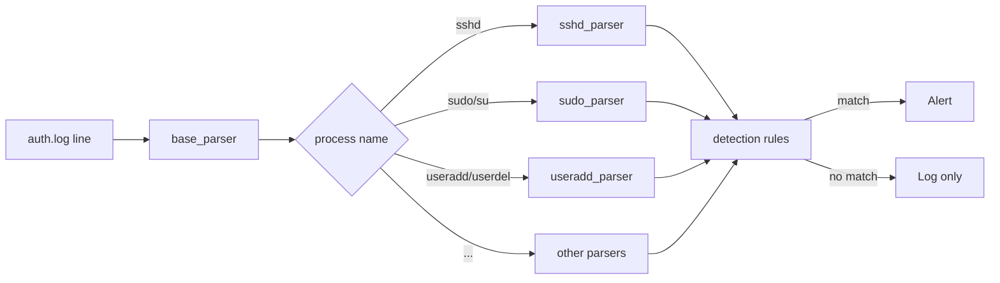

# Linux SIEM Tool
 
Real-time SSH log monitoring and threat detection system with alerts mapped to MITRE ATT&CK. Connects to a remote Linux machine over SSH, parses `/var/log/auth.log` in real time, and fires alerts when suspicious activity is detected.
 
## How does it work
 
After connecting to a host via SSH, the tool continuously reads the auth log stream, parses each line, and runs it through a set of detection rules.
 
### 1. Log ingestion
 
The tool connects over SSH using `paramiko` and tails `/var/log/auth.log` in real time. Each line is parsed by `base_parser`, which extracts:
 
- Timestamp
- Hostname
- Process name (`sshd`, `sudo`, `useradd`, etc.)
- PID
- Port
- Raw message
### 2. Process-specific parsing
 
After base parsing, each log line is routed to a specialized parser depending on the process that generated it:
 
| Process | Parser | What it extracts |
|---------|--------|-----------------|
| `sshd` | `sshd_parser` | Username, IP, event type (failed password, accepted publickey, invalid user, etc.) |
| `sudo` / `su` | `sudo_parser` | Username, event type (failed sudo, not in sudoers, sudo command) |
| `passwd` | `passwd_parser` | Username, password change events |
| `useradd` | `useradd_parser` | New username, group |
| `userdel` | `userdel_parser` | Deleted username, group |
| `groupadd` / `groupdel` | `groupadd_parser`, `groupdel_parser` | Group name |
| `systemd-logind` | `systemd_parser` | Username, session events |
 
### 3. Detection rules
 
Each parsed event is evaluated against a set of detection rules. Rules are stateful where needed — for example, brute force detection maintains a sliding time window of failed attempts per IP.
 

 
### 4. Streamlit dashboard
 
Alerts and logs are passed to a Streamlit dashboard via thread-safe queues. The dashboard auto-refreshes every 3 seconds and displays:
 
- Live log feed (last 1000 events)
- Real-time alert panel with severity, MITRE ATT&CK mapping, and description
## Detection Coverage
 
| Rule | MITRE ATT&CK | Severity | Description |
|------|-------------|----------|-------------|
| Brute Force | T1110.001 | High | 5+ failed passwords from the same IP within 30s |
| Root Login | T1078.003 | High | Successful password or publickey login as root |
| User Not in Sudoers | T1548.003 | High | Non-privileged user attempted sudo |
| Invalid User | T1087.001 | High | SSH login attempt for a non-existent username |
| Failed Sudo | T1548.003 | Medium | Incorrect password on sudo command |
| New User Added | T1136.001 | Medium | New system user created |
| User Deleted | T1531 | Medium | System user deleted |
| Password Changed | T1098 | Medium | User password changed |
| New Group | T1136 | Medium | New system group created |
 
## Run
 
```bash
git clone https://github.com/jjkusio/Linux-SIEM-Tool.git
cd Linux-SIEM-Tool
pip install -r requirements.txt
streamlit run parser.py
```
 
Enter the hostname/IP, username, and password of the target Linux machine in the sidebar. The tool connects via SSH and starts monitoring immediately.
 
Requirements: Python 3.10+, target machine running Linux with `/var/log/auth.log`, SSH access with sudo privileges.
 
## Example alerts
 
```
[2026-05-21 01:14:33] SEVERITY: High
Alert type: Brute Force
MITRE: T1110.001
Description: Attack from 192.168.1.105 - 5+ incorrect password for admin!
 
[2026-05-21 01:15:02] SEVERITY: High
Alert type: Root login
MITRE: T1078.003
Description: Login as root from: 192.168.1.105
 
[2026-05-21 01:22:17] SEVERITY: Medium
Alert type: New user added
MITRE: T1136.001
Description: new User (backdoor) added
```
 
## Roadmap
 
- More detection rules: credential stuffing, SSH scanning, off-hours login, repeated sudo failures, root session via systemd
- Basic events panel in the dashboard (login summary, active sessions)
- Support for more Linux distributions (currently tested on Ubuntu/Debian)
- SQL backend for persistent log and alert storage
- Detection rule configuration via UI (thresholds, enable/disable per rule)
## Author: Jan Kusiowski
