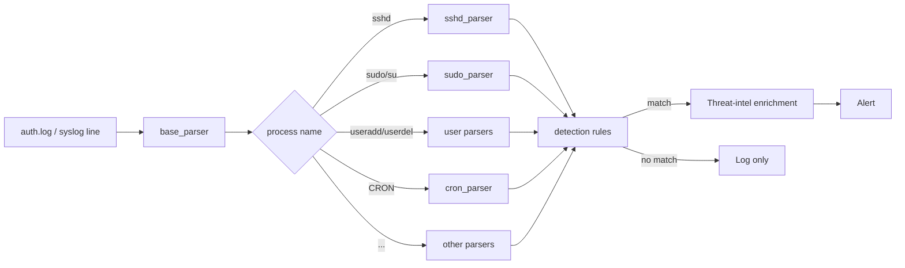

# Linux SIEM Tool
 
Real-time SSH log monitoring and threat detection system with alerts mapped to MITRE ATT&CK. Connects to a remote Linux machine over SSH, parses `/var/log/auth.log` and `/var/log/syslog` in real time, enriches alerts with threat intelligence, and surfaces everything on a live dashboard with a MITRE ATT&CK TTP report.
 
## How does it work
 
After connecting to a host via SSH, the tool continuously reads the log stream, parses each line, runs it through a set of detection rules, enriches any resulting alerts with threat-intel context, and pushes logs and alerts to the dashboard.
 
### 1. Log ingestion
 
The tool connects over SSH using `paramiko` (public-key authentication) and tails `/var/log/auth.log` and `/var/log/syslog` in real time. Each line is parsed by `base_parser`, which extracts:
 
- Timestamp
- Hostname
- Process name (`sshd`, `sudo`, `useradd`, `CRON`, etc.)
- PID
- Port
- Raw message
### 2. Process-specific parsing
 
After base parsing, each log line is routed to a specialized parser depending on the process that generated it:
 
| Process | Parser | What it extracts |
|---------|--------|-----------------|
| `sshd` | `sshd_parser` | Username, IP, event type (failed password, accepted publickey, invalid user, etc.) |
| `sudo` / `su` | `sudo_parser` | Username, event type (failed sudo, not in sudoers, sudo command) |
| `passwd` | `passwd_parser` | Username, password change events |
| `useradd` | `useradd_parser` | New username, group |
| `userdel` | `userdel_parser` | Deleted username, group |
| `groupadd` / `groupdel` | `groupadd_parser`, `groupdel_parser` | Group name |
| `systemd-logind` | `systemd_parser` | Username, session events |
| `CRON` | `cron_parser` | Username, cron command |
 
### 3. Detection rules
 
Each parsed event is evaluated against a set of detection rules. Rules are stateful where needed, for example, brute force detection maintains a sliding time window of failed attempts per IP, and correlation rules (privilege escalation chain, successful login after brute force) track sequences of events per user or IP.
 

 
### 4. Threat intel enrichment
 
When a rule fires on an event that carries a source IP, the alert is enriched via the [AbuseIPDB](https://www.abuseipdb.com/) API with:
 
- Abuse confidence score (0–100)
- Total abuse reports
- Country
Lookups are cached for one hour per IP to stay within API rate limits.
 
### 5. Streamlit dashboard
 
Logs, alerts and events are passed to a Streamlit dashboard via thread-safe queues. The dashboard auto-refreshes every 3 seconds and displays:
 
- **Live log feed** - last 1000 parsed events
- **Alert panel** - severity, MITRE ATT&CK mapping (linked), description, and AbuseIPDB enrichment per alert
- **Overview** - KPIs (events, alerts, unique source IPs, critical alerts) and charts for top attacking IPs and event distribution
- **TTP table** - every alert mapped to its MITRE technique, tactic and procedure, with VirusTotal IoC links and one-click CSV export
## Detection Coverage
 
| Rule | MITRE ATT&CK | Severity | Description |
|------|-------------|----------|-------------|
| Successful Login After Brute Force | T1110 | Critical | Successful login from an IP that just produced 5+ failed attempts |
| Brute Force | T1110.001 | High | 5+ failed passwords from the same IP within 120s |
| Password Spray | T1110.003 | High | 5+ distinct usernames attempted from one IP within 120s |
| Distributed Brute Force | T1110 | High | Same user targeted from 3+ different IPs within 5 min |
| Root Login (password) | T1078.003 | High | Successful password login as root |
| Root Login (SSH key) | T1078.003 | High | Successful public-key login as root |
| Root Key Login from New IP | T1078 | High | Root public-key login from a previously unseen IP |
| User Not in Sudoers | T1548.003 | High | Non-privileged user attempted sudo |
| Privilege Escalation Chain | T1548 | High | Login followed by a sudo command within 3 min |
| New User + Sudo Abuse | T1136 | High | Newly created user runs sudo within 10 min |
| Invalid User | T1087.001 | High | SSH login attempt for a non-existent username |
| Suspicious Cron Job | T1053.003 | High | Cron command with a suspicious payload (curl, wget, /dev/tcp, nc, base64, ...) |
| Failed Sudo | T1548.003 | Medium | Incorrect password on a sudo command |
| Multiple Failed Sudo | T1548.003 | Medium | 3+ failed sudo attempts by one user within 2 min |
| Off-Hours Login | T1078 | Medium | Successful login between 22:00 and 05:00 |
| External IP Login | T1078 | Medium | Successful login from a non-private (external) IP |
| Session Flood | T1078 | Medium | 10+ sessions opened by one user within 60s |
| Username Enumeration | T1087.001 | Medium | 6+ distinct invalid usernames from one IP within 2 min |
| New User Added | T1136.001 | Medium | New system user created |
| User Deleted | T1531 | Medium | System user deleted |
| Password Changed | T1098 | Medium | User password changed |
| New Group | T1136 | Medium | New system group created |
 
## Run
 
```bash
git clone https://github.com/jjkusio/Linux-SIEM-Tool.git
cd Linux-SIEM-Tool
streamlit run main.py
```
 
## Example alerts
 
```
[2026-05-21 01:14:33] SEVERITY: High
Alert type: Brute Force
MITRE: T1110.001
Description: Attack from 192.168.1.105 - 5+ incorrect password for admin!
 
[2026-05-21 01:15:02] SEVERITY: Critical
Alert type: Brute Force Success
MITRE: T1110
Description: Successful login after brute force from 192.168.1.105
 
[2026-05-21 01:22:17] SEVERITY: Medium
Alert type: New user added
MITRE: T1136.001
Description: new User (backdoor) added
```
 
## Roadmap
 
- MITRE ATT&CK coverage visualization (heatmap of detected techniques)
- SQL backend for persistent log and alert storage
- More log sources (Sysmon/journald) and support for additional Linux distributions
## Author: Jan Kusiowski
